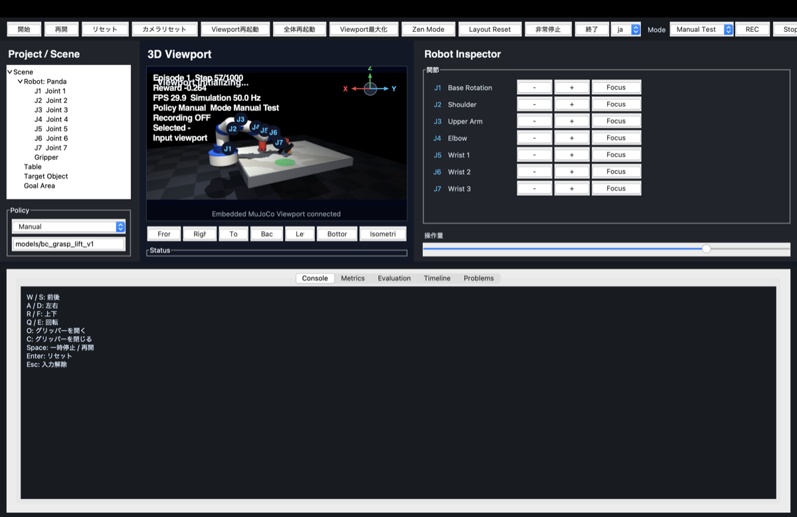

# Physical AI Sandbox

MuJoCo-based Physical AI sandbox for a Panda-style 7-axis robot arm. The project
now includes the Phase 1 manual-control environment, Phase 2 dataset pipeline,
Phase 3 offline Behavior Cloning training, Phase 3.5 closed-loop BC rollout
safety evaluation, Phase 4 PPO smoke training, and Phase 4.5 Japanese UI /
visual refresh.

## Requirements

- Python 3.11
- uv
- macOS, Linux, or another platform supported by MuJoCo Python

## Setup

```bash
uv sync
```

## Validate

```bash
uv run ruff check .
uv run pytest
uv run python scripts/validate_config.py
```

## Run Headless

```bash
uv run python scripts/run_headless.py --steps 1000
```

This runs reset, step, reward, success/failure checks, and optional logging
without opening a viewer.

## Run Manual Viewer

On macOS, MuJoCo's interactive viewer must be launched through `mjpython`:

```bash
uv run mjpython scripts/run_manual.py
```

On non-macOS platforms, normal Python is usually sufficient:

```bash
uv run python scripts/run_manual.py
```

Controls:

| Key | Action |
|---|---|
| 1-7 | Select joint directly |
| Tab or ] | Select next joint |
| [ | Select previous joint |
| Left arrow | Move selected joint negative |
| Right arrow | Move selected joint positive |
| Space | Toggle gripper |
| R | Reset |
| P | Pause |
| L | Toggle episode recording |
| C | Reset camera |
| Esc | Quit |

The MuJoCo passive viewer does not expose Shift modifiers consistently across
MuJoCo versions, so `[` is the reliable previous-joint fallback for Shift+Tab.
Headless operation remains the supported path for automated tests and future
reinforcement learning.


## Run Japanese Control Panel

Launch the Tkinter workspace with the integrated MuJoCo 3D Viewport:

```bash
uv run python scripts/run_control_panel.py
```

Launch in English:

```bash
uv run python scripts/run_control_panel.py --language en
```

The package entrypoint is also available:

```bash
uv run physical-ai-control-panel --language ja
```

The workspace keeps Tkinter in normal Python and runs MuJoCo simulation plus
offscreen rendering in a separate `mjpython` process. Rendered RGB frames are
sent back over IPC and displayed directly in the central 3D Viewport, so the
ControlPanel path does not open a separate MuJoCo Viewer window. It displays run
state, Episode, Step, Reward, Grasped, Lifted, Success, Recording, Controller,
and the latest manual event. It supports start, pause/resume, reset, quit,
recording start/stop, gripper open/close, camera reset, XYZ-style movement
buttons, rotation buttons, direct J1-J7 joint buttons, and a command-size slider.

Control-panel keyboard bindings:

| Key | Action |
|---|---|
| W / S | Forward / backward |
| A / D | Left / right |
| R / F | Up / down |
| Q / E | Rotate |
| O | Open gripper |
| C | Close gripper |
| Space | Pause / resume |
| Enter | Reset |
| Esc | Quit |

Detailed guides:

- `docs/UI_GUIDE_JA.md`
- `docs/UI_GUIDE_EN.md`

Screenshot placement: add UI screenshots under `docs/screenshots/`.

## Run Pick-and-Place Demo

```bash
uv run python scripts/run_pick_place_demo.py --record
```

To smoke-test Viewer startup and cleanup while showing the final state:

```bash
uv run python scripts/run_pick_place_demo.py --viewer --record --hold-seconds 1
```

The demo closes the gripper, grasps the cube, moves it to the target region,
opens the gripper, waits for the success-stability window, and records an
episode when `--record` is set. On macOS, the final-state Viewer is launched in
a child `mjpython` process so the parent process can clean it up if the GUI
backend hangs.

## Replay an Episode

```bash
uv run python scripts/replay_episode.py logs/episodes/episode_YYYYMMDD_HHMMSS
```

Replay reads the saved `steps.jsonl` actions and applies them to a fresh
environment. It is intended for behavior checks, bug reproduction, and dataset
audits.

## Scene Configuration

The default scene lives at `configs/default.yaml`.

Obstacles are declared in YAML and validated by `schemas/scene_config.schema.json`.
Phase 1 supports `box` and `cylinder`.

```yaml
objects:
  - id: obstacle_1
    type: box
    position: [0.50, 0.15, 0.85]
    size: [0.10, 0.20, 0.30]
    static: true
    collision: true
```


### UI and Visual Settings

```yaml
ui:
  language: ja
  theme: dark
  show_control_panel: true
  show_status_overlay: true
robot_visual:
  theme: modern_lab
  accent_color: blue
```

Older configs without these keys remain valid; defaults are applied by the
config loader. Japanese strings are used only in the display layer. Internal
body, joint, actuator, site, Observation, Action, Dataset, and checkpoint
contracts remain English and unchanged.

### Visual Refresh

The default generated MJCF now uses a modern lab-arm visual theme: off-white
robot covers, dark-gray joints, blue accent rings, dark gripper covers, an
orange cube, green translucent target/place markers, blue translucent pick
marker, red obstacles, neutral-gray table, and a dark grid floor. Added covers,
rings, plates, cables, and area markers are visual-only geoms with collision
disabled so the existing physics contract is preserved.

## Action Contract

Actions are fixed as eight floats:

```python
[
    joint_1_delta,
    joint_2_delta,
    joint_3_delta,
    joint_4_delta,
    joint_5_delta,
    joint_6_delta,
    joint_7_delta,
    gripper_command,
]
```

Joint deltas and gripper command are clipped to `[-1.0, 1.0]` before use.

## Observation Contract

Every observation contains:

- `joint_positions`: `float[7]`
- `joint_velocities`: `float[7]`
- `gripper_positions`: `float[2]`
- `cube_position`: `float[3]`
- `cube_rotation`: `float[4]`
- `end_effector_position`: `float[3]`
- `is_grasped`: `bool`
- `is_success`: `bool`
- `elapsed_time`: `float`

These fields are stable API for downstream dataset, imitation learning, and
reinforcement learning work.


## Build Phase 2 Dataset

Build a Behavior-Cloning-ready dataset from Phase 1 episode logs:

```bash
uv run python scripts/build_dataset.py \
  --episodes logs/episodes \
  --output datasets/pick_place_v1 \
  --seed 42
```

Validate the dataset:

```bash
uv run python scripts/validate_dataset.py datasets/pick_place_v1
```

Inspect a short summary:

```bash
uv run python scripts/inspect_dataset.py datasets/pick_place_v1
```

Dataset output structure:

```text
datasets/pick_place_v1/
├── train.npz
├── validation.npz
├── test.npz
├── metadata.json
├── statistics.json
├── quality_report.json
└── manifest.json
```

Saved arrays:

- `observations`
- `actions`
- `rewards`
- `terminated`
- `truncated`
- `success`
- `episode_ids`
- `step_indices`

Splits are made by Episode, not by step, so the same Episode cannot appear in
multiple splits. The builder records broken Episode directories in
`quality_report.json` and excludes them from the built dataset unless strict mode
is requested.


## Train Phase 3 Behavior Cloning

Train the initial Behavior Cloning policy on a Phase 2 dataset:

```bash
uv run python scripts/train_behavior_cloning.py \
  --dataset datasets/pick_place_v1 \
  --output models/bc_pick_place_v1 \
  --epochs 80 \
  --seed 42
```

Evaluate a saved checkpoint:

```bash
uv run python scripts/evaluate_behavior_cloning.py \
  models/bc_pick_place_v1 \
  --dataset datasets/pick_place_v1
```

Model output structure:

```text
models/bc_pick_place_v1/
├── policy_checkpoint.npz
├── metadata.json
├── training_history.json
└── evaluation_report.json
```

Phase 3 currently uses a small NumPy MLP for Behavior Cloning pipeline
verification. The current dataset has only 5 valid Episodes and a 5-sample test
split, so evaluation metrics are supervised Action-prediction smoke-test metrics,
not evidence of robot-task performance.


## Phase 3.5 Behavior Cloning Rollout

Run a trained BC checkpoint through the Environment API in headless mode:

```bash
uv run python scripts/evaluate_bc_rollout.py \
  models/bc_pick_place_v1 \
  --episodes 3 \
  --max-steps 200 \
  --seed 42
```

The rollout CLI loads `policy_checkpoint.npz`, applies the same Observation
normalization saved during training, clips the fixed 8D Action, stops safely on
NaN/Inf output, records rollout Episodes under `logs/bc_rollouts`, replays
recorded actions, and writes `rollout_report.json`.

Reported rollout metrics include success rate, average reward, grasp rate, lift
rate, goal-reaching rate, replay count, and aggregated failure reasons. With the
current 5-Episode dataset, these metrics verify pipeline safety only; they are
not evidence of robot-control performance or generalization.


## Phase 3.6 Fixed-Condition Grasp+Lift Data

Collect fixed-initial-condition grasp+lift demonstrations:

```bash
uv run python scripts/collect_grasp_lift_demos.py \
  --episodes 30 \
  --output logs/grasp_lift_demos \
  --seed 42 \
  --overwrite
```

Build and validate the simplified-task dataset:

```bash
uv run python scripts/build_dataset.py \
  --episodes logs/grasp_lift_demos \
  --output datasets/grasp_lift_v1 \
  --name grasp_lift \
  --version v1 \
  --seed 42
uv run python scripts/validate_dataset.py datasets/grasp_lift_v1
```

Train and rollout-evaluate the simplified-task BC checkpoint:

```bash
uv run python scripts/train_behavior_cloning.py \
  --dataset datasets/grasp_lift_v1 \
  --output models/bc_grasp_lift_v1 \
  --epochs 120 \
  --seed 42
uv run python scripts/evaluate_bc_rollout.py \
  models/bc_grasp_lift_v1 \
  --episodes 10 \
  --max-steps 120 \
  --seed 42 \
  --log-root logs/bc_grasp_lift_rollouts
```

Phase 3.6 keeps the task intentionally narrow: fixed initial cube/robot state,
immediate gripper close, then lift. The generated `datasets/grasp_lift_v1` has
30 Episodes and 1800 samples. The resulting rollout report tracks both the
original Pick-and-Place `success_rate` and the simplified-task
`grasp_lift_success_rate`; only the latter applies to this phase. These numbers
are fixed-condition evaluation results, not generalization or full Pick-and-Place
performance claims.


## Phase 4 PPO Smoke Training

Train a short fixed-condition grasp+lift PPO smoke run from the Phase 3.6 BC checkpoint:

```bash
uv run python scripts/train_ppo.py \
  --output models/ppo_grasp_lift_bc_smoke \
  --dataset datasets/grasp_lift_v1 \
  --bc-model models/bc_grasp_lift_v1 \
  --init bc \
  --total-steps 256 \
  --rollout-steps 64 \
  --max-episode-steps 120 \
  --seed 42
```

Evaluate a saved PPO checkpoint:

```bash
uv run python scripts/evaluate_ppo.py \
  models/ppo_grasp_lift_bc_smoke \
  --episodes 5 \
  --max-steps 120 \
  --seed 42
```

Compare BC-only, random PPO, and BC-initialized PPO smoke runs:

```bash
uv run python scripts/compare_ppo.py \
  --output models/ppo_phase4_smoke_compare \
  --dataset datasets/grasp_lift_v1 \
  --bc-model models/bc_grasp_lift_v1 \
  --episodes 3 \
  --max-steps 120 \
  --total-steps 128 \
  --rollout-steps 64 \
  --seed 42
```

Phase 4 PPO is intentionally a short End-to-End smoke pipeline: Environment,
rollout buffer, GAE, clipped PPO objective, value loss, entropy term, gradient
clipping, checkpoint save/reload, resume, evaluation, and comparison reporting.
The initial task remains fixed-initial-condition grasp+lift. PPO can degrade
from the BC-only baseline, and these smoke results are not full Pick-and-Place or
generalization evidence.


## Policy Evaluation

Phase 5 adds a headless policy evaluation foundation for fixed-initial-condition grasp+lift comparisons.

Evaluate one policy:

```bash
uv run python scripts/evaluate_policy.py \
  --policy bc \
  --model models/bc_grasp_lift_v1 \
  --episodes 20 \
  --seed 42 \
  --headless \
  --max-steps 200 \
  --output logs/evaluation/bc_seed42.json
```

Compare policies with the same seed contract:

```bash
uv run python scripts/compare_policies.py \
  --policies random,bc,ppo \
  --bc-model models/bc_grasp_lift_v1 \
  --ppo-model models/ppo_grasp_lift_bc_smoke \
  --episodes 10 \
  --seed 42 \
  --max-steps 200 \
  --output-dir logs/evaluation/compare_seed42
```

Outputs include JSON, CSV, and Markdown summaries. Current results are fixed-condition grasp+lift smoke checks only; UI evaluation controls and Viewer replay are still pending. See `docs/policy_evaluation.md`.

## macOS Local Launcher

Build a local-only macOS launcher app:

```bash
bash scripts/clean_macos_build.sh
bash scripts/build_macos_app.sh
```

Output:

```text
dist/Physical AI Sandbox Launcher.app
```

Launch it with Finder double-click, or:

```bash
open -n "dist/Physical AI Sandbox Launcher.app"
```

This Launcher is not a distributable self-contained app. It is only a local
startup app for this Mac, and it runs the existing development command without
opening Terminal:

```bash
cd "/Users/miyachiasuka/Documents/prog/Physical AI Sandbox"
uv run python scripts/run_control_panel.py
```

Local requirements:

- The project exists at `/Users/miyachiasuka/Documents/prog/Physical AI Sandbox`.
- `uv` is installed and visible from the login shell PATH.
- Dependencies have already been installed with `uv sync`.
- `mjpython` is available through `uv run mjpython`.

The Launcher starts the local development command directly from the GUI app
process, so Terminal is not opened. Logs are stored under:

```text
~/Library/Logs/Physical AI Sandbox Launcher/
```

The Launcher prevents duplicate `run_control_panel.py` processes and reports
startup failures with a Japanese dialog. The Tk workspace runs under normal
Python, while MuJoCo simulation and embedded Viewport rendering run in a
separate `mjpython` process. It does not bundle Python, MuJoCo, datasets,
checkpoints, or project dependencies.

Detailed guides:

- `docs/MACOS_APP_GUIDE_JA.md`
- `docs/MACOS_APP_GUIDE_EN.md`

## Current Phase 1 Status

Implemented:

- MuJoCo scene with floor, table, Panda-style 7-axis arm, two-finger gripper,
  cube, target region, and YAML obstacles.
- Fixed Action and Observation contracts.
- Safe action clipping.
- Headless reset/step/reward/success/failure checks.
- Episode logging to `logs/episodes`.
- Action replay.
- JSON Schema validation for config.
- pytest coverage for config, environment, recorder, replay, obstacles, reset
  stability, and NaN checks.

Known limitations are tracked in `KNOWN_ISSUES.md`. Detailed Phase 1 completion status is in `PHASE1_COMPLETION_STATUS.md`.

## Integrated Workspace MVP

The macOS control panel now starts as a workspace-style UI: toolbar, scene/policy sidebar, embedded 3D Viewport, robot inspector, and bottom Console/Metrics/Evaluation/Timeline tabs. The ControlPanel path does not open a separate MuJoCo Viewer window; the simulation process renders frames offscreen and streams them into the central Viewport.

Key UX changes:

- Text fields no longer dispatch W/A/S/D/Space robot shortcuts while focused.
- Escape clears text focus instead of quitting the app.
- Restart Viewer, Restart All, and Emergency Stop controls are available from the toolbar.
- The embedded Viewport supports left-drag Orbit, Shift-left-drag or middle-drag Pan, mouse-wheel Zoom, double-click Focus/Isometric, Camera Reset, and Front/Right/Top/Back/Left/Bottom/Isometric presets.
- A Viewport camera gizmo is drawn in the upper-right and can switch to Top/Front/Right/Isometric views.
- J1-J7 are shown in the Robot Inspector, Scene Tree, and Viewport overlay; selecting a joint synchronizes the Tree, overlay, Inspector highlight, and camera focus.
- Workspace panes are draggable, Viewport Maximize and Zen Mode hide surrounding panels, and layout/camera/mode/overlay state is saved under the local Application Support folder.
- Manual Test and AI Recording modes are separated. Recording commands are blocked in Manual Test mode and the Viewport displays `REC` only while recording.
- Manual Test sessions do not auto-end or reset at 1000 steps; the simulation state is preserved until the user presses Reset.
- Idle rendering is throttled so the paused workspace does not stream unchanged frames continuously.

See `docs/ui_workspace.md`, `docs/robot_visual_language.md`, and `PHASE5_1_TO_5_9_STATUS.md`.

Current Workspace screenshot:



## Sim2Real and Perception MVP

Phase 6/7 MVP interfaces are available for future hardware and camera work:

- `physical_ai_sandbox.robotics`: `RobotInterface`, `SimulationRobot`, `MockRealRobot`, and `SafetyLayer`.
- `physical_ai_sandbox.perception`: `CameraSource`, `MockCamera`, `ObjectPerception`, and `ObservationBuilder`.

These are scaffolds only. No real robot or real camera validation is claimed. See `docs/sim2real_interface.md` and `docs/perception_pipeline.md`.
